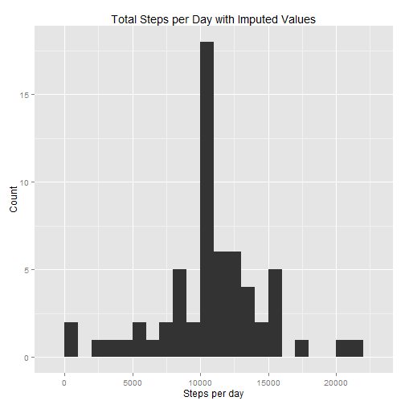

# Reproducible Research: Peer Assessment 1

## Load necessary libraries

```r
library(ggplot2)
library(data.table)
```


## Loading and preprocessing the data

```r
setwd("E:/documents/ebooks/ML_AI/RepData_PeerAssessment1")
data <- read.csv("activity.csv")
#convert date from string to Date format
data$date <- as.Date(data$date, format="%Y-%m-%d")
```

## What is mean total number of steps taken per day?

```r
#calculate total number of steps per day
total_steps_per_day <- aggregate(steps ~ date, data, sum)

#plot histogram
ggplot(data=total_steps_per_day,aes(x=steps)) + geom_histogram(binwidth=5000) +
    labs(title="Total Steps per Day",x="Steps per day",y="Count")
```

 

```r
#calculate mean and median total steps per day
mean_tot_steps_per_day <- mean(total_steps_per_day$steps,na.rm=T)
median_tot_steps_per_day <- median(total_steps_per_day$steps,na.rm=T)
```


## What is the average daily activity pattern?

```r
mean_steps_by_interval <- aggregate(steps ~ interval, data, mean)
ggplot(data=mean_steps_by_interval,aes(x=interval,y=steps)) + geom_line() +
    labs(title="Average Steps by Interval",x="Interval",y="Mean number of steps")
```

 

```r
subset(mean_steps_by_interval,steps==max(steps))$interval
```

```
## [1] 835
```


## Imputing missing values

```r
#calculate total number of rows with missing values
count_rows_with_missing_values <- sum(!complete.cases(data))

#create new df and impute NA values using rounded mean value for the interval
data_im <- data

for (j in 1:nrow(data_im)) {
    if(is.na(data_im[j,1])){
        data_im[j,1] <- round(subset(mean_steps_by_interval,interval==data_im$interval[j])[2])
        }
}

#calculate total number of steps per day with imputed values
total_steps_per_day_im <- aggregate(steps ~ date, data_im, sum)

#plot histogram with imputed values
ggplot(data=total_steps_per_day_im,aes(x=steps)) + geom_histogram(binwidth=5000) +
    labs(title="Total Steps per Day with Imputed Values",x="Steps per day",y="Count")
```

 

```r
#calculate mean and median total steps per day with imputed values
mean_tot_steps_per_day_im <- mean(total_steps_per_day_im$steps,na.rm=T)
median_tot_steps_per_day_im <- median(total_steps_per_day_im$steps,na.rm=T)


#Do these values differ from the estimates from the first part of the assignment? 
#What is the impact of imputing missing data on the estimates of the total daily number of steps?
```


## Are there differences in activity patterns between weekdays and weekends?

```r
data_im$day_type <- as.factor(ifelse(weekdays(data_im$date) %in% c("Saturday","Sunday"),"weekend","weekday"))

mean_steps_by_interval_by_day_type <- aggregate(steps ~ interval+day_type, data_im, mean)

ggplot(data=mean_steps_by_interval_by_day_type,aes(x=interval,y=steps)) +
    geom_line() +
    facet_grid(day_type ~ .) + 
    labs(Title="Average Steps by Interval and Day Type",x="Interval",y="Steps")
```

 
